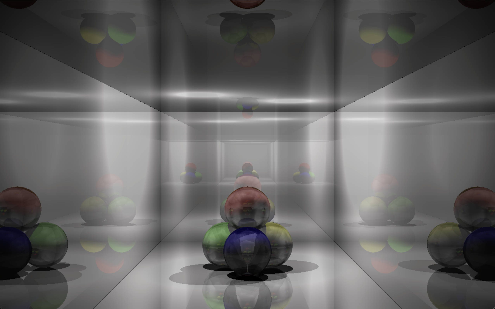
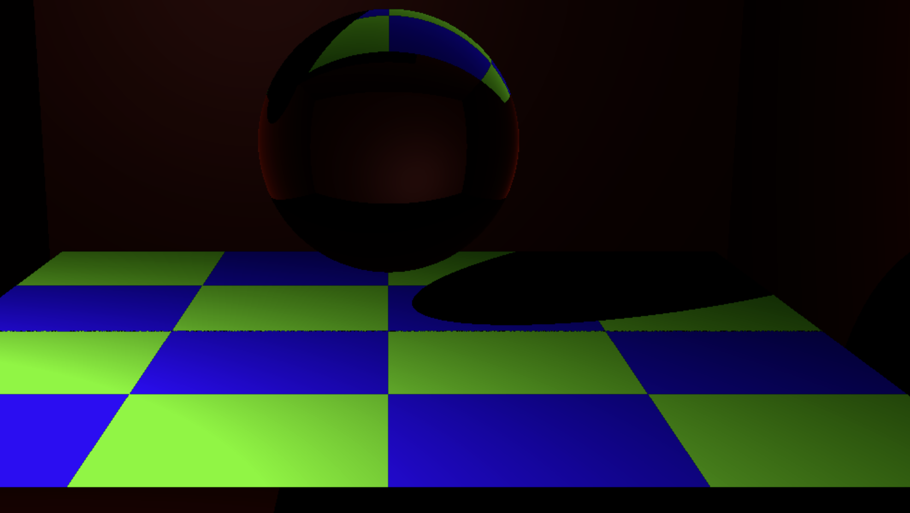

# RT

This is a raytracing engine written in C using the SDL2 graphics library. It was originally created as a final semester group project at WeThinkCode_ in 2016.

## Credits

This project was a collaborative effort. The majority of the original code was written by **adippena**. **rojones** also contributed significantly to the codebase and assisted me with the majority of my contributions.

## Features

*   Renders scenes from custom scene files.
*   Can render OBJ files as objects in the scene.
*   Supports multiple light sources.
*   Different coloured lights.
*   Glossy and transparent materials.
*   Object colours.
*   Light intensity falloff.

## Screenshots


_A scene with reflective and refractive spheres._


_A scene showcasing object and light variations._

## Scene File Format

The scene file format is a simple text-based format. Each object in the scene is defined by a block of text, with properties indented by a tab.

### Global Properties

*   `MAXDEPTH`: The maximum recursion depth for reflections and refractions.

### Camera

Defines the viewpoint for the scene.

```
CAMERA
    LOC    x y z
    DIR    x y z
    UP     x y z
```

*   `LOC`: The location of the camera in 3D space.
*   `DIR`: The direction the camera is pointing.
*   `UP`: The up vector for the camera.

### Light

Defines a light source in the scene.

```
LIGHT
    LOC        x y z
    COLOUR     RRGGBB
    INTENSITY  value
    HALF       value
```

*   `LOC`: The location of the light in 3D space.
*   `COLOUR`: The colour of the light in hexadecimal format.
*   `INTENSITY`: The intensity of the light.
*   `HALF`: The half-distance for light attenuation.

### Material

Defines a material that can be applied to objects.

```
MATERIAL
    NAME       material_name
    DIFFUSE    RRGGBB intensity
    SPECULAR   RRGGBB intensity
    REFLECT    value
    REFRACT    value
    IOR        value
```

*   `NAME`: A unique name for the material.
*   `DIFFUSE`: The diffuse colour and intensity of the material.
*   `SPECULAR`: The specular colour and intensity of the material.
*   `REFLECT`: The reflectivity of the material (0 to 1).
*   `REFRACT`: The refractivity of the material (0 to 1).
*   `IOR`: The index of refraction of the material.

### Primitive

Defines a primitive object in the scene.

```
PRIMITIVE
    TYPE       sphere|plane|cylinder|cone|disk
    LOC        x y z
    DIR        x y z
    NORMAL     x y z
    RADIUS     value
    ANGLE      value
    MATERIAL   material_name
```

*   `TYPE`: The type of primitive.
*   `LOC`: The location of the primitive in 3D space.
*   `DIR`: The direction of the primitive (for cones and cylinders).
*   `NORMAL`: The normal vector of the primitive (for planes).
*   `RADIUS`: The radius of the primitive.
*   `ANGLE`: The angle of the primitive (for cones).
*   `MATERIAL`: The name of the material to apply to the primitive.

### Object

Defines an object from an OBJ file.

```
OBJECT
    FILE       path/to/file.obj
    MATERIAL   material_name
```

*   `FILE`: The path to the OBJ file.
*   `MATERIAL`: The name of the material to apply to the object.