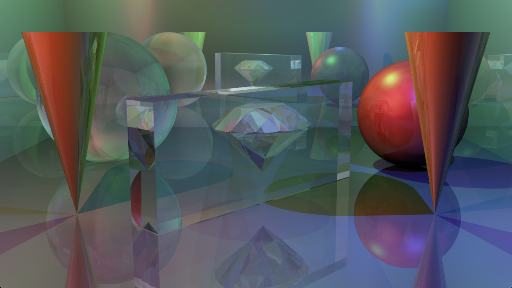
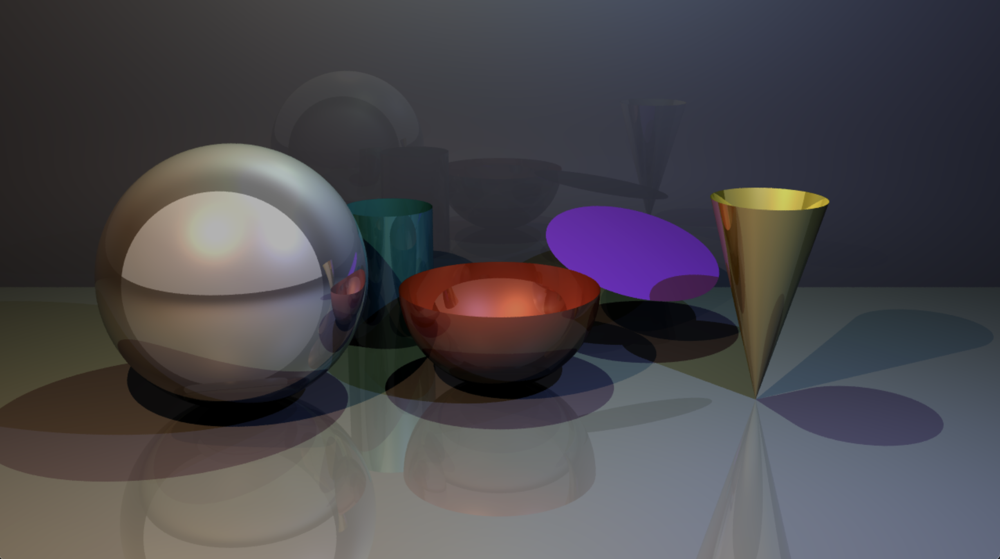
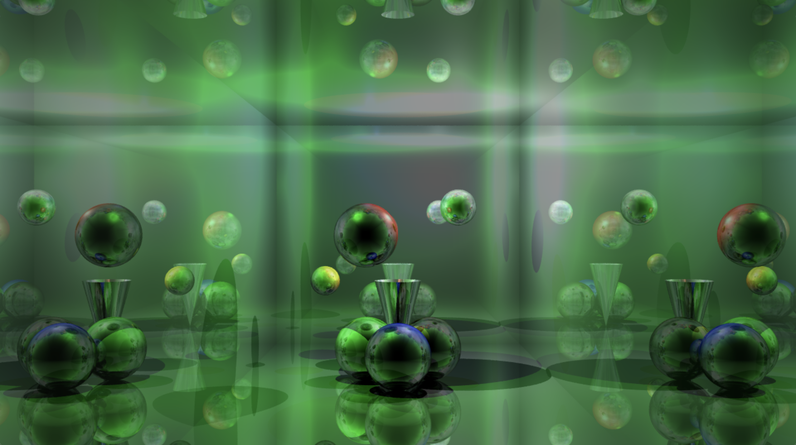
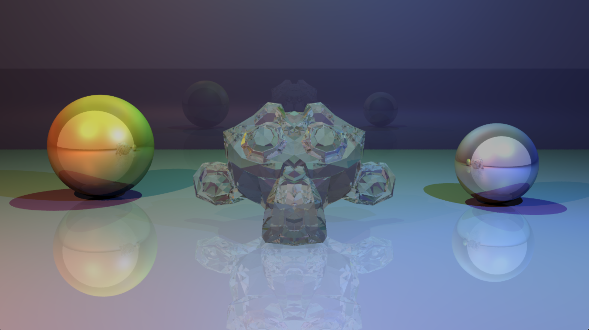

# RT

A raytracing engine written in C11 with SDL2. Originally created as a final semester group project at WeThinkCode_ (42 school network) in 2016.

The original unmodified codebase is preserved on the [`archive`](../../tree/archive) branch.


*Diamond mesh inside a glass box with reflective walls, refractive spheres, and colored lighting.*

## Features

- Multiple colored light sources with intensity falloff
- Recursive reflections and refractions (configurable depth)
- Glossy, matte, and transparent materials
- Primitive types: sphere, plane, cylinder, cone, disk, hemisphere
- OBJ mesh import with bounding-box culling
- Per-pixel jittered supersampling (antialiasing) via the `SUPER` scene parameter
- Multithreaded rendering (64x64 pixel chunks, one pthread per chunk)
- Interactive camera controls (translate, rotate, zoom)
- Scene serialization (save/load)
- BMP export

## Gallery


*All supported primitive types: sphere, hemisphere, cylinder, cone, and disk.*


*Reflective and refractive spheres in a mirrored room.*


*Blender's Suzanne OBJ mesh rendered with glass material and colored lights.*

## Build & Run

**Dependencies:** GCC, SDL2 (`sdl2-config` must be in PATH), pthreads, math library.

```bash
make          # Build RT executable
make re       # Full rebuild
make clean    # Remove object files
make fclean   # Remove all build artifacts
./RT <scene>  # Render a scene file, e.g. ./RT scenes/showcase_diamond_room
```

Compiler flags: `-Wall -Wextra -Werror -O3 -pthread -std=c11`

## Scene File Format

Scenes are tab-indented declarative text files. See example scenes in `scenes/`.

### Global Settings

| Setting    | Description                                         |
|------------|-----------------------------------------------------|
| `MAXDEPTH` | Maximum recursion depth for reflections/refractions |
| `RENDER`   | Image resolution as `width height`                  |
| `SUPER`    | Antialiasing samples per pixel (1 = off)            |

### Blocks

**Camera**
```
CAMERA
	LOC		x y z
	DIR		x y z
	UP		x y z
```

**Light**
```
LIGHT
	LOC		x y z
	COLOUR		RRGGBB
	INTENSITY	value
	HALF		value
```
`HALF` controls the half-distance for light attenuation.

**Material**
```
MATERIAL
	NAME		material_name
	DIFFUSE		RRGGBB intensity
	SPECULAR	RRGGBB intensity
	REFLECT		value
	REFRACT		value
	IOR		value
```
`REFLECT` and `REFRACT` range from 0 to 1. `IOR` is the index of refraction.

**Primitive**
```
PRIMITIVE
	TYPE		sphere|plane|cylinder|cone|disk|hemisphere
	LOC		x y z
	DIR		x y z
	NORMAL		x y z
	RADIUS		value
	ANGLE		value
	MATERIAL	material_name
```

**Object** (OBJ mesh)
```
OBJECT
	FILE		path/to/file.obj
	MATERIAL	material_name
```

## Credits

This project was a collaborative effort. The majority of the original code was written by **adippena**. **rojones** also contributed significantly to the codebase and assisted me with the majority of my contributions.

Performance optimisations and codebase commenting were done with the assistance of [Claude](https://claude.ai) by Anthropic.
